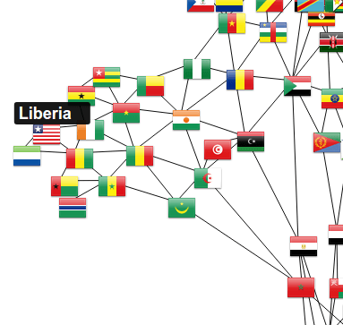

# D3 Force Directed Graph

## Description

This project uses d3.js to display which countries share borders. A shared border is represented by an edge between the flags of the two countries. A user can place their cursor over a flag and see the name of the country.

## Live Demo

https://coymeetsworld.github.io/d3-force-directed-graph

	

## About

This project was written by Coy Sanders as a requirement in the [Data Visualization Projects](https://www.freecodecamp.com/challenges/show-national-contiguity-with-a-force-directed-graph) for [FreeCodeCamp](http://www.freecodecamp.com) to earn the Data-Visualization Development Certification.

software is licensed under the 

Copyright (c) 2017 
